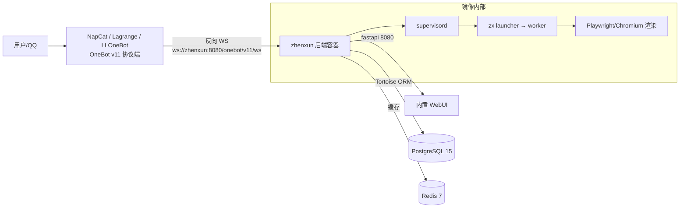

# Zhenxun Docker Framework

面向 [zhenxun-org](https://github.com/zhenxun-org) 组织项目的 **Linux Docker 后端 Bot 框架**：为 [绪山真寻 Bot](https://github.com/zhenxun-org/zhenxun_bot) 打包完整的 Linux 运行环境，通过 GitHub Actions **CICD 自动构建并上传 Docker Hub**（多架构），作为后端框架与 NapCat / Lagrange / LLOneBot 等 OneBot v11 协议端对接使用。

结构参考 [SnowLuma.Docker.Framework](https://github.com/SnowLuma/SnowLuma.Docker.Framework) 与 [AstrBot](https://github.com/AstrBotDevs/AstrBot)：镜像内集成运行环境、`supervisord` 守护进程、`start.sh` 注入配置并等待依赖就绪，支持 `linux/amd64` 与 `linux/arm64`。

## ✨ 集成资源

本框架结合利用了 zhenxun-org 组织内**一切可集成资源**：

| 组织仓库 | 在框架中的角色 |
| :--- | :--- |
| [zhenxun_bot](https://github.com/zhenxun-org/zhenxun_bot) | 核心 Bot（NoneBot2 + OneBot V11），镜像内构建运行，含内置 WebUI、插件商店 |
| [zhenxun_bot_plugins](https://github.com/zhenxun-org/zhenxun_bot_plugins) | 官方插件库，构建时预装到 `zhenxun/plugins/` |
| [zhenxun-bot-resources](https://github.com/zhenxun-org/zhenxun-bot-resources) | UI 主题资源（`resources/themes`），构建时内置 |
| [zhenxun_bot_plugins_index](https://github.com/zhenxun-org/zhenxun_bot_plugins_index) | 插件商店数据源，内置插件商店据此在线拉取/管理插件 |
| [zhenxun_bot_webui](https://github.com/zhenxun-org/zhenxun_bot_webui) | 已内置进 zhenxun_bot（`web_ui` 插件），框架直接暴露 8080 |
| [zhenxun-utils](https://github.com/zhenxun-org/zhenxun-utils) | 工具类依赖库，供插件开发者使用（镜像内 venv 可直接 `pip install`） |
| [zhenxun_docs](https://github.com/zhenxun-org/zhenxun_docs) | 官方文档，见 [在线文档](https://zhenxun-org.github.io/zhenxun_bot/) |
| [zhenxun_bot-deploy](https://github.com/zhenxun-org/zhenxun_bot-deploy) | 传统一键部署脚本（本框架的容器化替代方案） |
| [nb-cli-plugin-zhenxun](https://github.com/zhenxun-org/nb-cli-plugin-zhenxun) | 开发/部署辅助 CLI 插件（可在镜像内 `nb` 使用） |
| [zhenxunflow](https://github.com/zhenxun-org/zhenxunflow) | 插件商店工作流机器人（维护者工具，与本框架无运行时耦合） |

## 🏗️ 架构



- **单容器后端**：Bot 本体 + 官方插件 + UI 主题 + Playwright 渲染，`supervisord` 守护 `zx` launcher（launcher 自行守护 worker 并优雅退出）。
- **与协议端解耦**：真寻只提供 OneBot v11 反向 WS 服务（`/onebot/v11/ws`），NapCat 等协议端以**独立进程/容器**对接本后端，互不耦合、可独立升级。
- **compose 全栈**：Bot + PostgreSQL（必选）+ Redis（可选缓存）+ 可选 NapCat（`--profile onebot`）。

## 🚀 快速开始

> 前置：Linux 主机已安装 Docker（含 Compose v2）。

### 方式一：直接使用 Docker Hub 已发布镜像（推荐）

```bash
# 1. 克隆框架 (含 compose 与示例配置)
git clone <本框架仓库地址>
cd zhenxun.Docker.Framework

# 2. 生成配置并编辑 (超级用户、WebUI 密码、数据库密码等)
cp .env.example .env
vi .env

# 3. 指定已发布镜像并启动 (无需本地构建)
ZHENXUN_IMAGE=zhenxun-org/zhenxun-docker-framework:latest docker compose up -d

# 4. 查看日志与 WebUI 临时密码
docker compose logs -f zhenxun
# 日志中出现: WebUI 临时密码: xxxx
# WebUI: http://<服务器IP>:8080/
```

### 方式二：docker compose 本地构建

```bash
docker compose up -d          # 首次自动预取源码并构建镜像 (需几分钟)
```

### 方式三：脚本一键启动

```bash
./scripts/run.sh              # 首次生成 .env 后编辑, 再执行一次
PROFILE=onebot ./scripts/run.sh   # 额外启动 NapCat QQ 客户端
```

## 🔄 CICD 自动上传 Docker Hub

`.github/workflows/docker-image.yml` 实现镜像的自动构建与发布：

| 触发方式 | 行为 | 镜像标签 |
| :--- | :--- | :--- |
| 推送 `v*` tag | 发布版（含 `beta/alpha/rc` 预发布识别） | `{version}` + `latest`（仅稳定版） |
| 每日 02:00 UTC 定时 | 跟踪上游 main 的 nightly | `nightly-latest`、`nightly-{日期}-{sha}` |
| 手动 `workflow_dispatch` | 自定义 tag / 上游版本 | 输入 tag（默认 `dev`） |

- **多架构**：`linux/amd64` + `linux/arm64`（QEMU + buildx 单次构建并推送 manifest）。
- **主仓库**：Docker Hub；**镜像**：可选推送到 GHCR。
- **构建缓存**：`type=gha`，重复构建快速。

### 配置 Secrets / Variables

在仓库 **Settings → Secrets and variables → Actions** 配置：

| 类型 | 名称 | 说明 |
| :--- | :--- | :--- |
| Secret | `DOCKER_HUB_USERNAME` | Docker Hub 用户名（必填） |
| Secret | `DOCKER_HUB_PASSWORD` | Docker Hub Access Token（必填，见 Docker Hub → Account Settings → Security） |
| Variable | `IMAGE` | Docker Hub 仓库，默认 `zhenxun-org/zhenxun-docker-framework` |
| Variable | `GHCR_IMAGE` | GHCR 镜像仓库，设为 `none` 关闭 GHCR 推送 |
| Variable | `ZHENXUN_REF` / `PLUGINS_REF` / `RESOURCES_REF` | 上游版本，默认 `main` |

## ⚙️ 环境变量

完整列表见 [.env.example](.env.example)，常用项：

| 变量 | 默认值 | 说明 |
| :--- | :--- | :--- |
| `SUPERUSERS` | `[""]` | 超级用户 QQ 号（JSON 数组） |
| `COMMAND_START` | `[""]` | 指令前缀（JSON 数组） |
| `NICKNAME` | 见示例 | Bot 昵称（JSON 数组） |
| `PLATFORM_SUPERUSERS` | `{}` | 平台超级用户（JSON 对象） |
| `ONEBOT_ACCESS_TOKEN` | 空 | OneBot 反向 WS 令牌，需与协议端一致 |
| `DB_URL` | 自动组装 | 数据库连接串（支持 postgres/mysql/sqlite） |
| `DB_HOST/DB_PORT/DB_USER/DB_PASSWORD/DB_NAME` | `db/5432/zhenxun/zhenxun/zhenxun` | 组装 `DB_URL` 用 |
| `CACHE_MODE` | `REDIS` | `NONE` / `MEMORY` / `REDIS` |
| `REDIS_HOST/PORT/PASSWORD/EXPIRE` | `redis/6379/空/600` | Redis 缓存 |
| `HOST` / `PORT` | `0.0.0.0` / `8080` | Bot 监听（容器内固定 8080 映射到宿主机） |
| `WEBUI_USERNAME` / `WEBUI_PASSWORD` | `admin` / 自动生成 | 内置 WebUI 登录；未设密码时首次启动打印临时密码 |
| `HTMLRENDER_BROWSER_ARGS` | `--no-sandbox --disable-dev-shm-usage` | Chromium 渲染参数（容器内默认已禁用沙箱） |
| `SYSTEM_PROXY` | 空 | 系统代理 |
| `TZ` | `Asia/Shanghai` | 时区 |
| `ZHENXUN_UID` / `ZHENXUN_GID` | `1000` | 容器内用户映射 |
| `ZHENXUN_IMAGE` | `zhenxun/docker-framework:latest` | compose 使用的镜像（设为 Docker Hub 已发布镜像可跳过构建） |
| `ZHENXUN_REF` / `PLUGINS_REF` / `RESOURCES_REF` | `main` | 构建时使用的源码版本 |

> 所有写入 `.env.dev` 的键均支持通过环境变量覆盖；修改后 `docker compose up -d --force-recreate zhenxun` 生效。

## 🔌 端口

| 端口 | 用途 |
| :--- | :--- |
| `8080` | Bot WebUI / OneBot HTTP 与反向 WS 端点（`/onebot/v11/ws`） |
| `6099` | NapCat WebUI（启用 `onebot` profile 时） |

## 💾 数据卷

| 卷 | 容器路径 | 内容 |
| :--- | :--- | :--- |
| `zhenxun-data` | `/app/zhenxun/data` | 数据库迁移、config.yaml、插件配置、token 等 |
| `zhenxun-resources` | `/app/zhenxun/resources` | UI 主题、图片/字体等（首次自动回填镜像内置主题） |
| `zhenxun-log` | `/app/zhenxun/log` | Bot 日志 |
| `zhenxun-plugins` | `/app/zhenxun/zhenxun/plugins` | 官方插件（首次自动回填），商店安装的插件也在此持久化 |
| `pgdata` | `/var/lib/postgresql/data` | PostgreSQL 数据 |
| `redisdata` | `/data` | Redis 持久化 |
| `napcat-*` | `/app/napcat/...` | NapCat 配置/QQ 数据/插件/日志 |

## 🤖 对接 OneBot v11 协议端

真寻作为**后端框架**，通过 OneBot v11 反向 WebSocket 与协议端通信：`ws://zhenxun:8080/onebot/v11/ws`（容器内 `zhenxun` 即本服务名）。官方文档推荐 [NapCat](https://github.com/NapNeko/NapCatQQ) / [Lagrange.Core](https://github.com/LagrangeDev/Lagrange.Core) / [LLOneBot](https://github.com/LLOneBot/LLOneBot)。

### 使用内置 NapCat（可选）

```bash
docker compose --profile onebot up -d
docker compose --profile onebot logs -f napcat     # 扫码登录
```

登录后在 NapCat WebUI（`http://<IP>:6099`）新建 WebSocket 客户端：

```
地址: ws://zhenxun:8080/onebot/v11/ws
令牌: 与 ONEBOT_ACCESS_TOKEN 一致 (未设置则留空)
```

或预置配置：将 `config/napcat/onebot11.json.example` 复制为 `onebot11_<QQ号>.json` 放入 NapCat 配置卷（详见 [config/napcat/README.md](config/napcat/README.md)）。

### 使用外部协议端

在宿主机/其它容器运行 NapCat / Lagrange / LLOneBot，将反向 WS 指向：

```
ws://<宿主IP>:8080/onebot/v11/ws
```

## 🧩 插件与主题

- **官方插件**：构建时自动内置 `zhenxun_bot_plugins` 全部插件到 `zhenxun/plugins/`。容器内可用 Bot 的 `插件商店` 命令管理（基于 `zhenxun_bot_plugins_index`）。
- **自定义插件**：挂载到卷或 `EXT_PATH` 指定目录（如 `-v ./my_plugins:/app/zhenxun/ext_plugins` 并设 `EXT_PATH=["/app/zhenxun/ext_plugins"]`）。
- **主题**：内置 `zhenxun-bot-resources` 的 default/dark 主题，可在 `data/config.yaml` 的 `UI: THEME` 切换，或挂载 `./config/themes:/app/zhenxun/resources/themes` 覆盖。

## 🐳 本地构建镜像

```bash
# 预取源码 (zhenxun_bot + 插件 + 主题)
./scripts/fetch-sources.sh

# 本地构建 (amd64)
./scripts/build-image.sh

# arm64
PLATFORM=linux/arm64 ./scripts/build-image.sh

# 指定版本并推送
ZHENXUN_REF=v0.2.4-fix3 PUSH=1 IMAGE=yourname/zhenxun:v0.2.4 ./scripts/build-image.sh
```

> 不预取源码也可直接构建：Dockerfile 的 `prepare` 阶段会按 `ZHENXUN_REF` 等 ARG 自动 clone。
> 多架构自动发布请使用 `.github/workflows/docker-image.yml`。

## 📖 常用命令

```bash
docker compose logs -f zhenxun          # 日志
docker compose exec zhenxun bash        # 进入容器
docker compose exec zhenxun supervisorctl status   # 进程状态
docker compose exec zhenxun cat /app/VERSION       # 上游 zhenxun_bot 版本
docker compose restart zhenxun          # 重启
docker compose down                     # 停止 (加 -v 删除数据卷)
```

## ❓ 常见问题

- **WebUI 登录提示"配置为空"**：设置 `WEBUI_PASSWORD` 后重建容器，或编辑卷内 `data/configs/plugins2config.yaml` 的 `web-ui` 段。
- **图片渲染失败 / Chromium 崩溃**：镜像已默认注入 `--no-sandbox --disable-dev-shm-usage` 且 compose 设置 `shm_size: 1gb`；如自建容器请保留这两项。
- **首次启动较慢**：需要执行数据库迁移、初始化配置并预热 Playwright，属正常现象（`start_period: 60s`）。
- **宿主机端口被占用**：修改 `.env` 中 `ZHENXUN_PORT`。
- **挂载目录权限问题**：将 `ZHENXUN_UID/GID` 设为宿主机用户 id（`id -u` / `id -g`）。
- **更新 Bot 版本**：重新发布镜像或 `docker compose build --build-arg ZHENXUN_REF=<新版本>` 后 `up -d`（插件卷内容不会被覆盖，如需重置删除 `zhenxun-plugins` 卷）。

## ⚠️ 注意

请遵守 zhenxun-org 各仓库的 AGPL-3.0 许可与第三方软件许可。本框架与 zhenxun-org 官方无直接关联，属社区运行框架。
